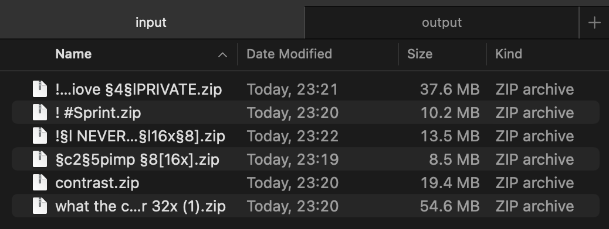
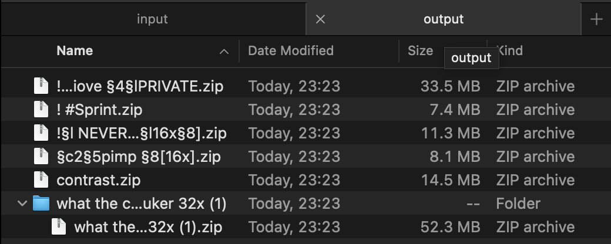
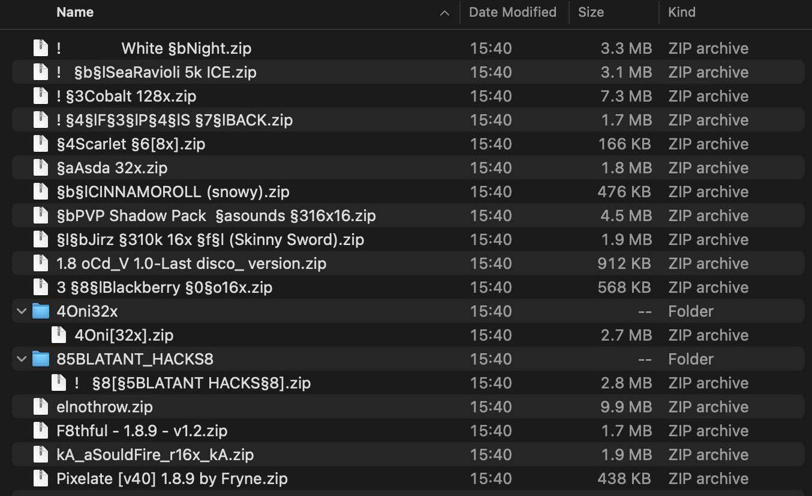

# Texture-Pack-Cleaner
Remove files that are the same as **original** or **meaningless** in a custom texture pack.

---
### Size Comparison
- **Before**

- **After**

---

### TO-DO
- [ ] Custom sounds support: `asset/minecraft/sounds`
- [ ] Custom font support: `asset/minecraft/font`
- [ ] More versions (not just 1.8.9)

### Usage
- Put your texture packs in `./input/` folder, can be folders or `.zip` files
- Run `./main.py` 
- Check `./output/` folder after seeing 
  ```
  ...
  DONE.
  ```

### Known Bugs 
- `main.py`: `build()` _line 82_
  - Static images with `.mcmeta` files will be also recognized as dynamic images
- `main.py`: `build()` _line 208_
  - For nested empty folders, only the deepest level will be removed.
---
### Fun Facts
- POV: You disabled all the OptiFine features:

  Every pack is getting so small and clean lol